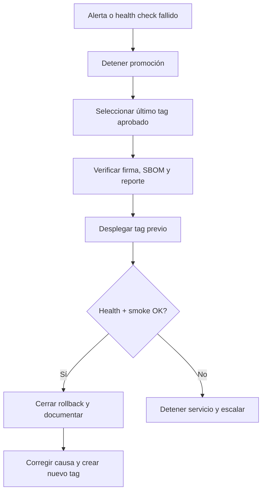

# Rollback futuro

```mermaid
flowchart TD
  A["Alerta o health check fallido"] --> B["Detener promoción"] --> C["Seleccionar último tag aprobado"]
  C --> D["Verificar firma, SBOM y reporte"] --> E["Desplegar tag previo"] --> F{"Health + smoke OK?"}
  F -->|"Sí"| G["Cerrar rollback y documentar"]
  F -->|"No"| H["Detener servicio y escalar"]
  G --> I["Corregir causa y crear nuevo tag"]
```

